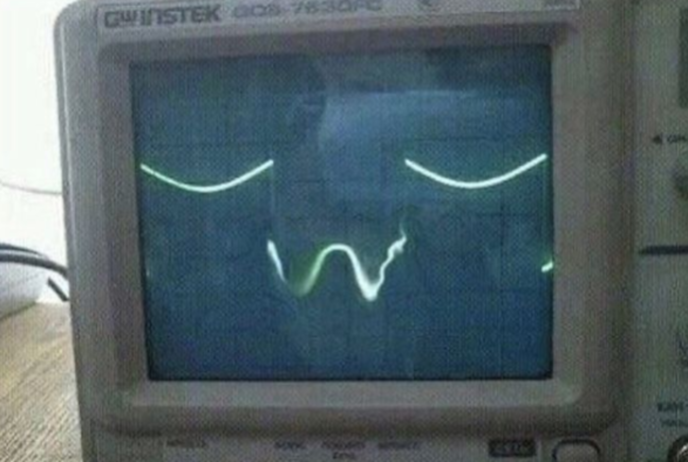

# Simple Curve Automatic Market Maker (SCAMM)

Prueba de concepto de AMM para el curso de [Introducción al desarrollo DeFi](https://intro-defi.marto.lol/), continuación del curso de [Introducción al desarollo en Ethereum](https://intro-ethereum.marto.lol/). Contratos inspirados en [Uniswap v1](https://github.com/Uniswap/v1-contracts).

## Contratos
- [Exchange](contracts/Exchange.sol)
- [Registry](contracts/Registry.sol)

## Desafíos

- Agregar más tests
- Agregar [staking rewards](https://solidity-by-example.org/defi/staking-rewards/) para incentivar provisión de liquidez
- Agregar [mecanismo de upgrades](https://docs.openzeppelin.com/openzeppelin/upgrades) para cambiar el fee
  - Primero con [un solo owner](https://docs.openzeppelin.com/contracts/4.x/access-control), después con un [módulo de votación](https://docs.openzeppelin.com/contracts/4.x/api/governance)

## Licencia
Ni idea. MIT?

